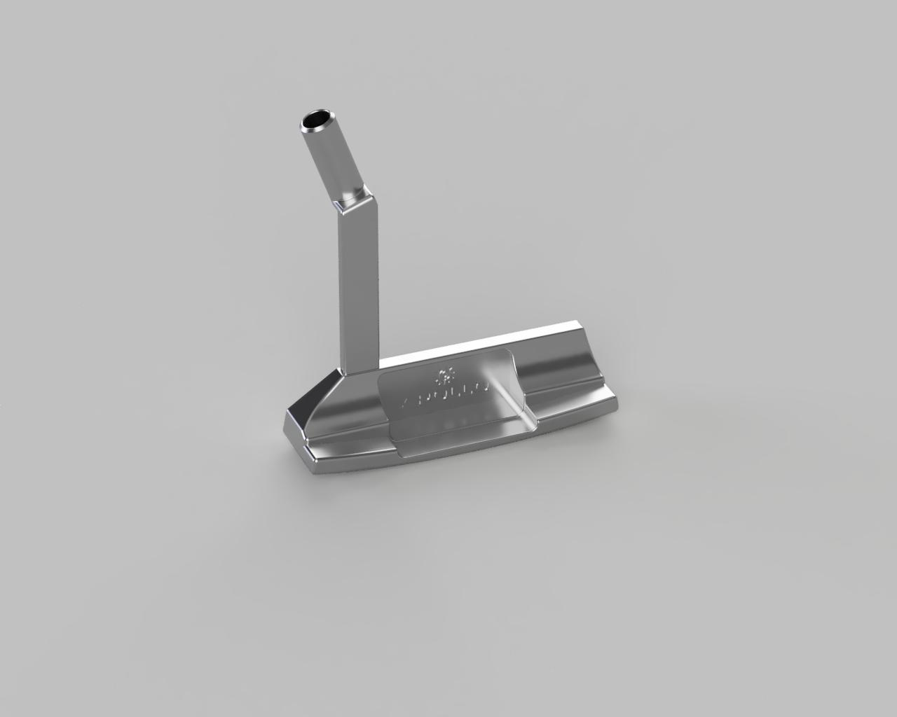

# Custom-Putter-Head
This is an original putter head design inspired by the Scotty Cameron Newport 2.

### Specifications:
- shaft insert diameter: 9.5 mm
- tolerance: +0.000 / +0.015 (H7 fit)

### Notes:
- the shape is inspired by the Newport 2 design
- the face has 3 degrees of loft and a 70 degree lie angle
- recommended material: stainless steel 303
- WARNING: I have never printed or tested these files so use at your own risk!!!